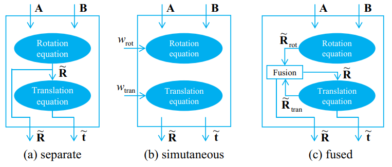
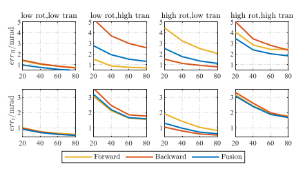
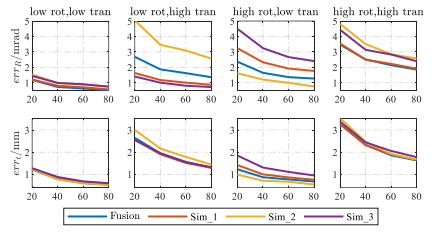
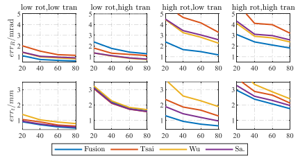
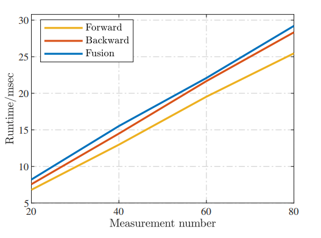

# RotFusion （ organizing the code 2024-04-03）

## A Practical Method For Hand-Eye Calibration Through Fusion

## Overview
Jin, G., Yu, X., Chen, Y., Zhang, L., Li, J. (2024), A Practical Method For Hand-Eye Calibration Through Fusion, submitted to IEEE/ASME Trans. Mech.

The hand-eye calibration problem is a fundamental problem in visual assisted robotics. Ensuring the calibration robustness is crucial as the calibration results are used in every task execution. Unlike traditional separate or simultaneous method, we propose a rotation fusion method to further improve the robustness. The proposed method is practical and includes four straightforward steps. First, the forward rotation estimate is obtained using the rotation of AX = XB. Second, the backward rotation estimate is achieved via the translation of AX = XB, which is not involved in existing methods. Third, the two rotation estimates are fused with identity covariance to cope with different noise conditions. Last, the translation estimate is obtained by a least-square minimization. Numerical simulations and real-world experiments are provided to validate the accuracy and robustness of the proposed fusion method. 

**_Figure_**: Signal flow diagrams of (a) the separate method, (b) the simultaneous method, and (c) our fusion method for hand-eye calibration.

**_Figure_**: The accuracy results of the comparative methods for Category 1.

**_Figure_**: The accuracy results of the comparative methods for Category 2.

**_Figure_**: The accuracy results of the comparative methods for Category 3.

**_Figure_**: The algorithm runtime of the comparative methods for Category 1.
