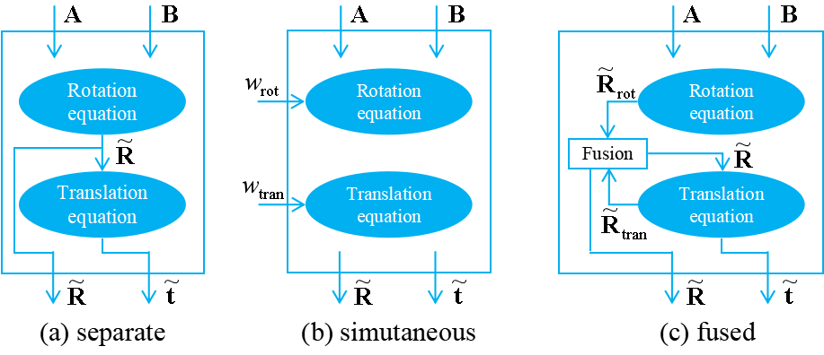

## A Practical Method For Hand-Eye Calibration Through Rotation Fusion

## Overview
Jin, G., Yu, X., Chen, Y., Li, J. (2024), A Practical Method For Hand-Eye Calibration Through Rotation Fusion, submitted to IEEE Sensors Journal.

The hand-eye calibration problem is a fundamental problem in visual assisted robotics. Ensuring the calibration robustness is crucial as the calibration results are used in every task execution. Unlike traditional separate or simultaneous method, we propose a rotation fusion method to further improve the robustness. The proposed method is practical and includes four straightforward steps. First, the forward rotation estimate is obtained using the rotation of AX = XB. Second, the backward rotation estimate is achieved via the translation of AX = XB, which is not involved in existing methods. Third, the two rotation estimates are fused with identity covariance to cope with different noise conditions. Last, the translation estimate is obtained by a least-square minimization. 


<p align="center">
   
</p>

**_Figure_**: Signal flow diagrams of (a) the separate method, (b) the simultaneous method, and (c) our fusion method for hand-eye calibration.


## How to use
### Dependencies
The code runs on Matlab R2023a without any additional dependencies. The necessary auxiliary functions can be found in the "auxiliary" folder.

### Main Instructions
To run the fusion calibration, call
```
[R_out,t_out,rnti]=HECfuse(RAin,tAin,RBin,tBin)
```
where
* ``RAin`` (3x3xn): rotation matrix of A,
* ``tAin`` (3xn): translation vector of A (unit: m),
* ``RBin`` (3x3xn): rotation matrix of B,
* ``tBin`` (3x3xn): translation vector of B (unit: m),
* ``R_out`` (3x3): rotation matrix of hand-eye pose,
* ``t_out`` (3x1): translation vector of hand-eye pose (unit: m),
* ``rnti`` (1×1)： runtime (unit: seconds).

The comparison methods include
* ``HECrot`` : forward separate method,
* ``HECtran`` : backward separate method,
* ``HECsim`` :  simultaneous method,
* ``HECTsai`` : Tsai's method,
* ``HECWu`` : Wu's method,
* ``HECSARA`` : Sarabandi's method.

Please refer to the submitted article or reference for details.

### Demos
Demo ``main1``, ``main2``, and ``main3`` correspond to the accuracy comparison of different types of methods, while Demo ``main4`` is a comparison of computational efficiency. When the program ends, a visual result will be presented.


## Reference
* Tsai R Y, Lenz R K. A new technique for fully autonomous and efficient 3 d robotics hand/eye calibration[J]. IEEE Transactions on robotics and automation, 1989, 5(3): 345-358.
* Wu J, Sun Y, Wang M, et al. Hand-eye calibration: 4-D procrustes analysis approach[J]. IEEE Transactions on Instrumentation and Measurement, 2019, 69(6): 2966-2981
* Sarabandi S, Porta J M, Thomas F. Hand-eye calibration made easy through a closed-form two-stage method[J]. IEEE Robotics and Automation Letters, 2022, 7(2): 3679-3686. 


## Contact

Gumin Jin, Department of Automation, Shanghai Jiao Tong University, Shanghai, jingumin@sjtu.edu.cn
